# Food And Wine Taste Master Quiz
Food and Wine Taste Master class quiz is a Javascript web application aimed at all food enthusiasts who wish to test their knowledge in the culinary world as well participating in the Taste Master World. All questions are based on the food and world cuisines as well as wine. The winners are to get a spot in the upcoming Taste Master World.

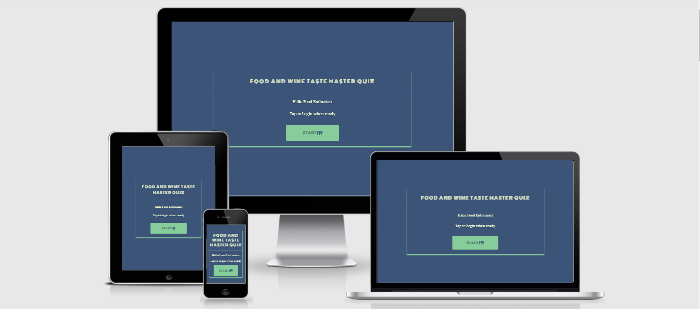

[Link to live website](https://pauline-rugwevera.github.io/food-and-wine-quiz/)

# UX
## Site Owner Goals
- Ensure  users know what to do when they arrive on the site
- Ensure a visually appealing site
- An easy to navigate site
- Ensure users can track their perfomace throughout
## New User Goals
- Easy Navigation
- Visual Appealing, well structured site
- An engaging application
- Easily track perfomance throughout to the end
## Returning User Goals
- User can enter their usernames
- User can track the time remaining before completing the quiz
- User can be able to share their results with friends and loved ones on social media
## User Stories
### New user
- As a First Time user, I want to easily understand the purpose of the site
- As a First Time user, I want to easily navigate the site
- As a First Time user, I want to easily track my score
- As a First Time user, I want to easily quit the game once done
- As a First Time user, I want to easily replay the game once done
### Returning user
- As a returning user, I want to be challenged with new questions
- As a returning user, I should be able to play the quiz on any device
# Design
## Colors
I created the quiz color scheme using [ColorHunt](https://colorhunt.co/palette/22577a38a3a557cc9980ed99). I used five colors eventually though at the beginning I had used only four. This was before I had checked the color contrast with [WebAim](https://webaim.org/resources/contrastchecker/), when I realised two of my colors were failing. In order not  to change everything completely, I added one more as it only covers a smaller part of the project. The final colors used follows:

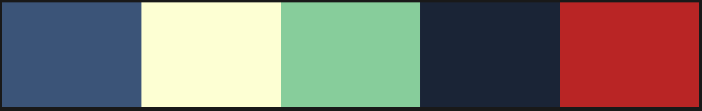
### Color scheme from left to right
- #22577A (navy): I used this color as the background and main color of the quiz. It covers every section of the quiz.
- #FFFDD0(cream):This color was used as a font color for all the quiz sections except for the buttons
- #57cc99(green): I used this green color as background color of buttons as I had chosen a darker color as the sole background, needed something to brighten and contrast up the quiz area. Also this color is used to create that shadow area of the quiz boxes of all sections. This green color appears as well when a the user chooses a correct answer, to indicate that their answer is correct. Lastly it is the background color of choice A-D, to keep everything consistent.

- #102637: I used this color as font color for buttons and choices A-D, but before that the font color was FFFDD0(cream), however it failed at color contrast checker with [WebAim](https://webaim.org/resources/contrastchecker/). Eventually had to use it as it contrasted well with background color green, and all other colors of the project.

- #DA1212(red): I used this color to tell the user if they choose a wrong answer. If they pick a wrong answer they will know before moving to the next question.

## Typography
There are two fonts used in this project. Firstly on the landing page  I wanted something eye catching as well as covering quite a space since this project does not have many categories, so I went on to use [Monoton](https://fonts.google.com/specimen/Monoton) for my main heading. For the questions, answers and every other information, I chose [Noto Serif](https://fonts.google.com/noto/specimen/Noto+Serif) as it is more readable for the users.

## Icons
I used the icons from [Font Awesome](https://fontawesome.com/) that are on the start button to further tell the users the type of the quiz they are about to play and the trophy on the results page
## Wireframes
I used [Balsamiq](https://balsamiq.com/) to give my site a design I wanted. I first drew a sketch using pen and paper before designing moving on to balsamiq so that I could see hpw it appears on web. I knew that I needed my site to be on one html page divided into sections easy to work with and how they should link together. The wireframes follows:
* Landing Page

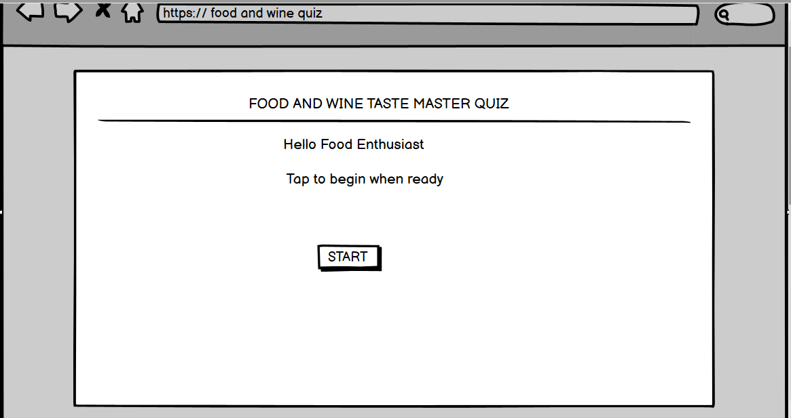

* Rules screen

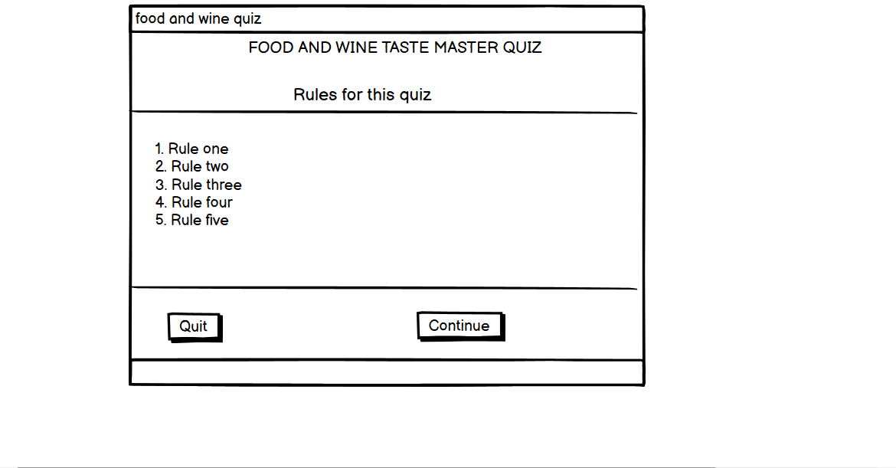

* Quiz screen

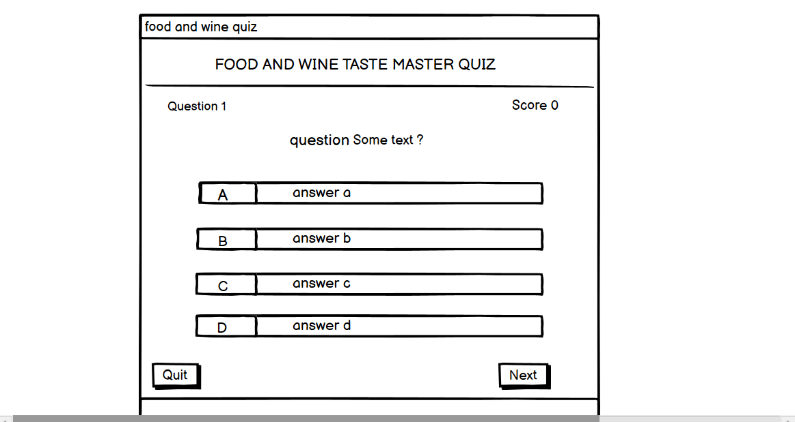

* Results screen

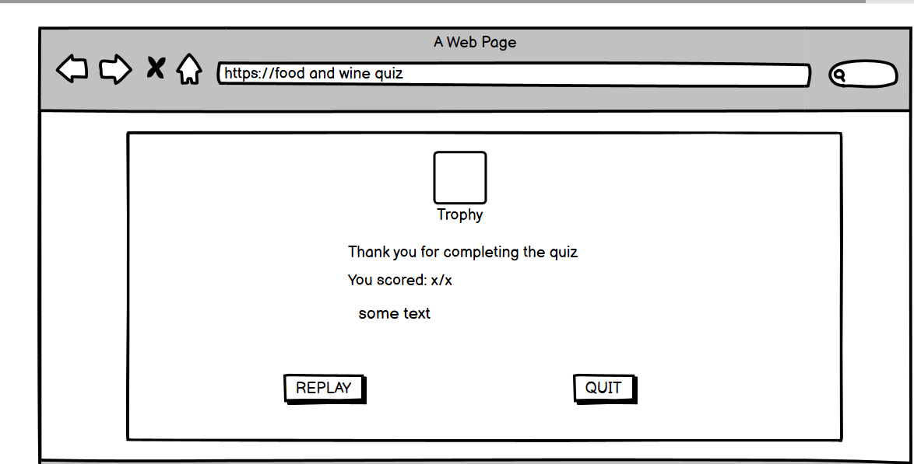

# Features
* The landing page

This is the first page users see when they visit the site. There is a clear start button which they will click and takes them to the next section of the quiz. The landing page contents are positioned in the middle of the page and responsive to all devices.
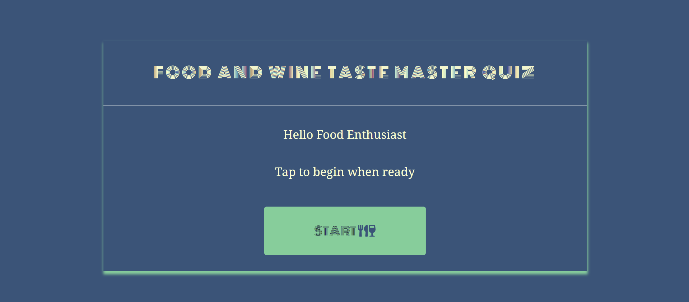

* The rules screen

This is the second page users will after the start button is selected. It contains all the rules of the game in which the player has to read them first and understand before proceeding. All rules are clear and go straight to the point. There are 7 rules to be understood before playing the quiz.

There is a quit button on the left of this page and a continue button on the right. The quit button allows the user to easily leave the quiz back to the landing page, the continue button allows the user to be presented with the quiz screen where they can begin taking the quiz.

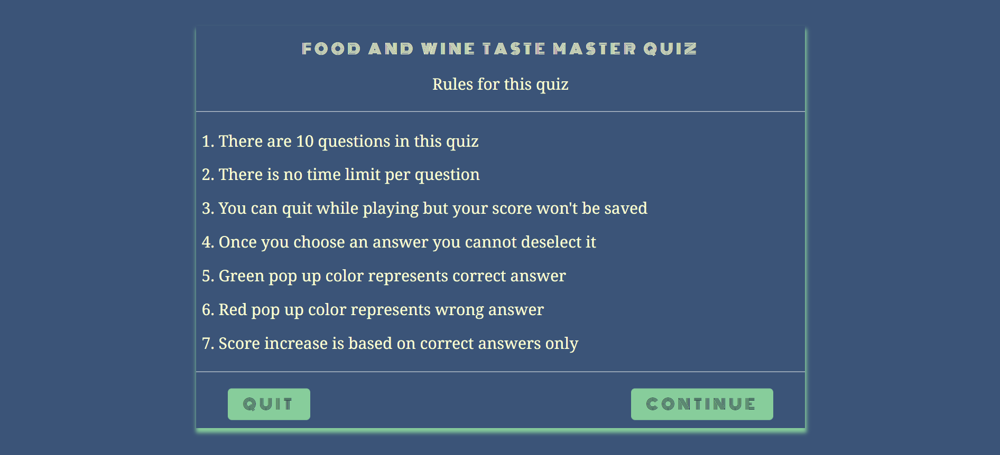 

* Quiz Screen

This is the main game area where all quiz questions and answers are displayed. It consists of the quiz header, questions and answers, quiz progress( question and score) as well as quit and next buttons. So the user is presented with questions with choices to choose from, the progress is displayed below the header with question number to the left, and the score to the right. he score increments each time the user choose a correct answer.

 If the user wishes to quit they can easily do so however their score will not be saved. Also users have to select their desired answer first before the next button can be activated. In doing so they have to know that once they select an answer they cannot deselect it.

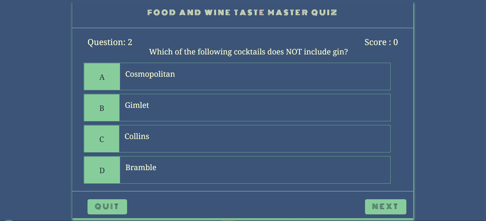

The questions are populated from a local array, easily readable with good color contrast. The answers are presented as A,B,C,D. A user have to select only one choice from the given four choices. If the correct answer is selected, a green color pops in. They can click the next button to be presented with a new question.

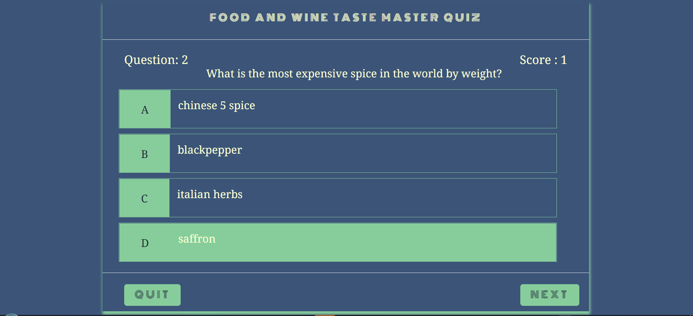

If wrong answer is selected, a red color flashes on the user selected choice, immediately green color flashes on the correct one.They can click the next button to be presented with a new question.

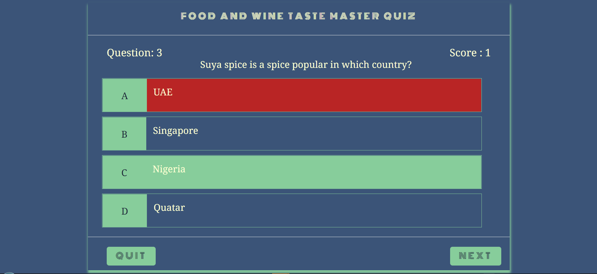

# Results page
This is the last section of the quiz that is shown to the user once they complete the quiz. It shows four main things, 
* The score
* The feedback information
* The Replay button
* The Quit button
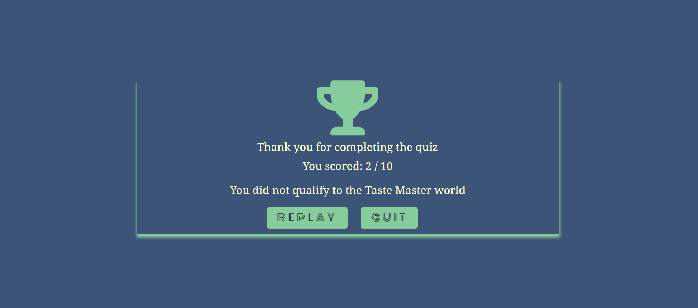

The score shows the final score the user get which has been incrementing along per each correct answer they chose. The feedback text shows the user if they had qualified to the TasteMaster World based on their final score. 

 If they score 5 out of 10 and below it means they did not qualify

 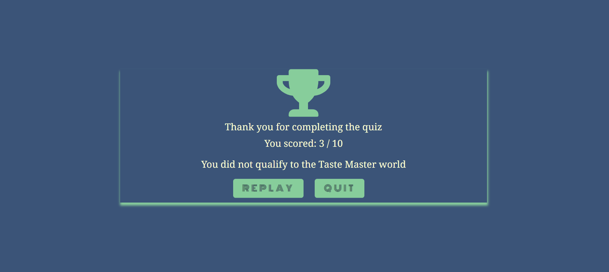

If they score 6 out of 10, they earn a place at the TasteMaster World.

 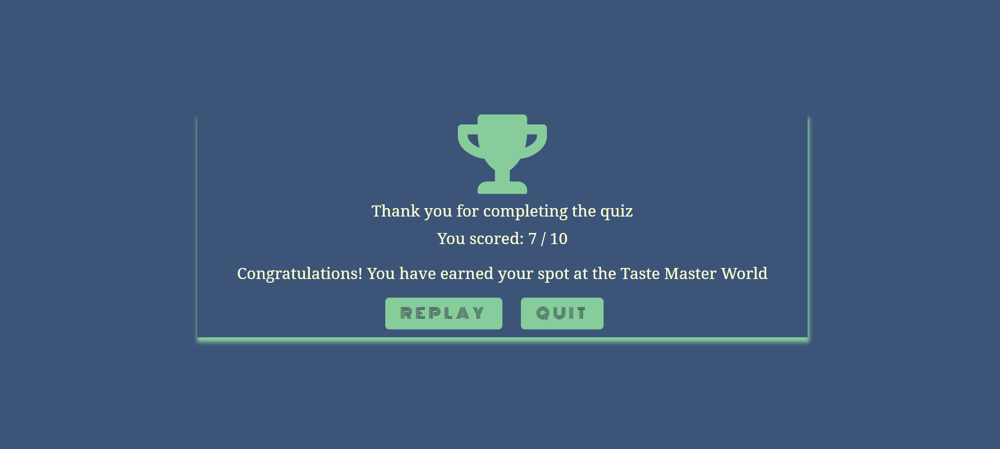

The Replay button allows the user to interact with site, allowing them to retake the quiz. Upon clicking this button, this will take them to the question screen page where they will be presented with the first question.

The Quit button is another way users will interact with this site. This page allows them to exit the quiz. When they click it, it will take them to the landing page.

## Future Features
* In the future I would l like to have category of questions so that users can choose what level and category they would want to play
* I would like a feature to allow users to share their results with their loved ones on social media

# Technologies
## Languages
HTML
 * Used a structure language to give this site a structure

 CSS
 * Used as a style language 

 Javascript
 * Functionality and responsive of the site

 ## Frameworks and Libraries
 Gitpod
* Used as a platform to develop the site

Google fonts
* Used as a font library

 Font awesome
 * Add icons to the project

 # Testing
 ## Layout Site development

 Easy to navigate is one the site owner's goals. The first design of the website was without buttons on the quiz screen. During testing with the mentor, the site looked fine, however to some with autism it was not quite friendly as there was no proper navigation suitable for them. to solve that I had to include the next button. Also I had designed it in such a way that one cannot quit in between the quiz. Had to change a little bit from my previous wireframes designs by adding the quit button to exit the quiz anytime as well as the next button.

 Adding on that my mentor thought the need to put an extra section of the quiz rules so that users get to understand how to go about the quiz. Created the wireframe of it and put an extra page for rules.

 After completing the site layout and styling, I needed to test out the color contrast and I used [WebAmi](https://webaim.org/resources/contrastchecker/). Two of my colors green and cream were failing. It was not in any intention to change everything completely so had to add an extra color for a good contrast. 

 ## Javascript
 The first problem I encountered with Javascript that took me hours to get through was displaying answers or choice corresponding to each question. All that was displaying was undefined. This however was solved using dataset attribute, that I attributed to all answers/choice text in html then created a function that displays them in html, a concept I learned from [James Q Quick](https://www.youtube.com/channel/UC-T8W79DN6PBnzomelvqJYw).

 After fixing the layout testing putting all the buttons in place and functionality, I realised a user can easily skip questions without answering them by clicking the next button. This took me a whole lot of hours trying to fix yet it was only one line of code needed. Solved this using the button disabled property from [W3C Schools](https://www.w3schools.com/jsref/prop_pushbutton_disabled.asp)

 Upon further testing, I also realized the questions were displaying in between the question count and the score instead of occupying a whole space. Also the maximum questions produced were 9 instead of the intended 10. To fix this, I had to add some margin to the questions so they could be displayed properly, only one line of code was needed to be adjusted. In the get new question function, I noticed that inside the if statement I had put the greater than or equal to the number of maximum questions which caused only 9 questions to be generated. I simply removed the equal sign to fix this respectively.

 Something I later realised when I thought the quiz was done was when a user selects the answer then decides to quit the quiz. The correct or wrong class applied there was carried on to the next time or round a user decides again to play the game. Fixing this,I had to call the function responsible for disabling these classes everytime the quit button is clicked.

 

 ## Functionality and compatibilty testing
 Chrome developer tools were used to test for functionality and compatibility for things like site responsiveness, debugging.  The site was tested on virtual devices as well as hardware devices like TAB E, Samsung A51.
 ## Perfomance testing
 I ran lighthouse in dev tools to check the perfomance of the site, the results follows:
 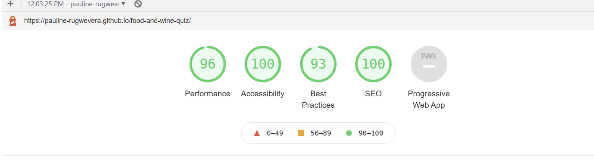
 ## Code validator
 I validated the markup and css using:

 [W3C Validator](https://validator.w3.org/). [Click to see results](https://validator.w3.org/nu/?doc=https%3A%2F%2Fpauline-rugwevera.github.io%2Ffood-and-wine-quiz%2F)

 [Jigsaw Validator](https://jigsaw.w3.org/css-validator/). [Click to see results](https://jigsaw.w3.org/css-validator/validator)
 
  
  # Deployment
Food And Wine Taste Master Quiz was deployed as follows:
* Open the repository on GitHub
* Go to "Settings" (the tab on the right)
* On the left hand side select "Pages" 
* Select the "main" branch as the source. Then it shows you a green confirmation "Your site is published at......" with the URL.

# Credits
## Content
The following websites were used for the quiz questions:
* https://www.mylondon.news/whats-on/food-drink-news/20-food-quiz-questions-answers-18151583
* https://www.radiotimes.com/quizzes/pub-quiz-food-and-drink/
* https://www.bbcgoodfood.com/howto/guide/food-quiz
* http://www.freepubquiz.co.uk/wine-quiz.html
* https://pubquizquestionshq.com/quiz/food-and-drink-quiz-round-21
* https://www.daytodaygk.com/gk-quiz-on-food-with-answers/

## Code
All the code production was done using [Gitpod](https://gitpod.io/) and passed in to [HTML validation Service](https://validator.w3.org/) and [CSS Validation Service](https://jigsaw.w3.org/css-validator/) as well as [JSHint](https://jshint.com/) to check for errors. The box shadow code is from [Coding Nepal](https://www.codingnepalweb.com/quiz-app-with-timer-javascript/) that I later adjusted to suit my design of preference. The actual quiz help came from [Web Dev Simplified](https://courses.webdevsimplified.com/) as well as [James Q Quick](https://www.youtube.com/channel/UC-T8W79DN6PBnzomelvqJYw). Icons are from [Font awesome](ontawesome.com). Thanks to [Geek for Geeks](https://www.geeksforgeeks.org/), [W3C Schools](https://www.w3schools.com/) and [Code greeper](codegrepper) for general explanation on CSS and Javascript.

### Acknowledgement
* My mentor
* Code Instute Slack community

 

