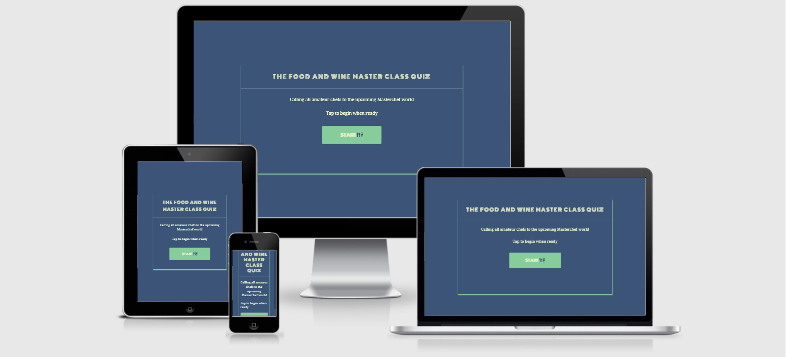
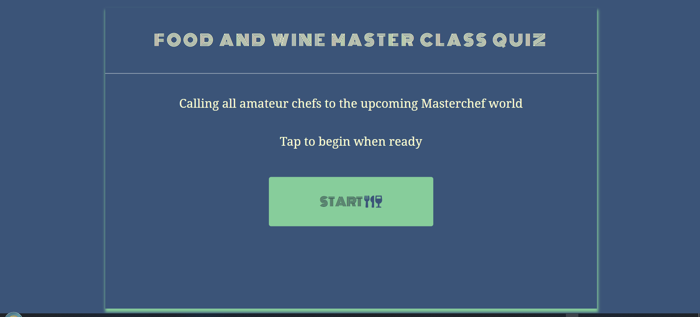
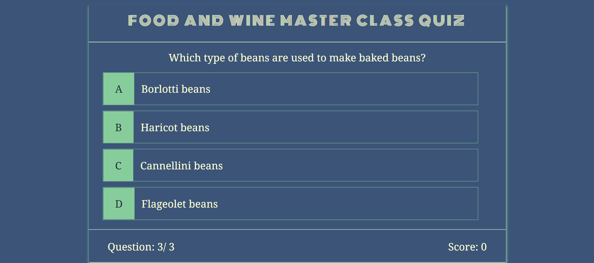
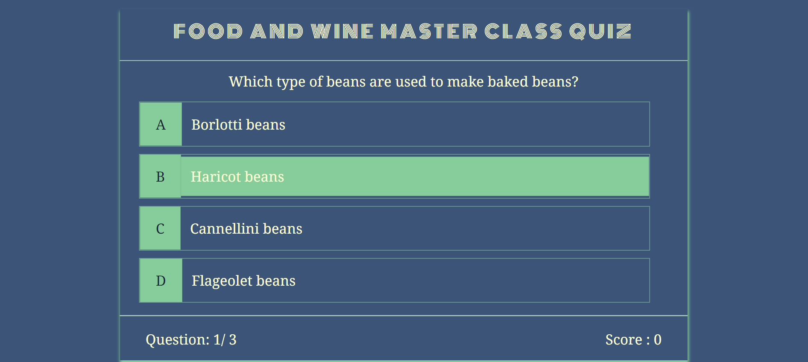
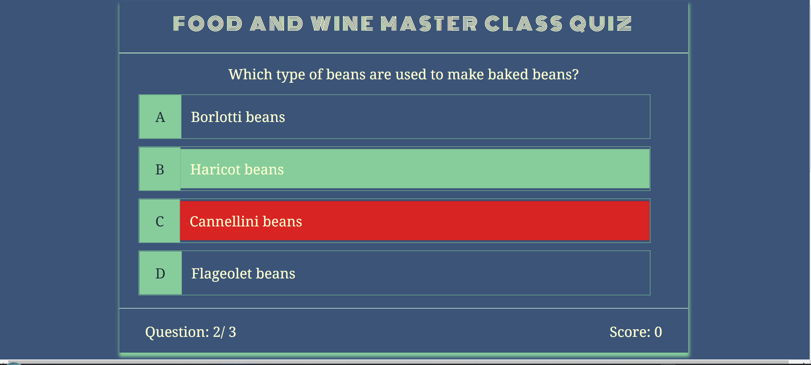

# The Food And Wine MasterClass Quiz
Food and Wine Masterclass quiz is a Javascript web application aimed at all food enthusiasts who wish to test their knowledge in the culinary world as well participating in the MasterChef World. All questions are based on the food and wine industry and world cuisines.

# UX
## Site Owner Goals
- Ensure  users what to do when they arrive on the site
- Ensure a visually appealing site
- An easy to navigate site
- Ensure users can track their perfomace throughout
## New User Goals
- Easy Navigation
- Visual Appealing, well structured site
- An engaging application
- Easily track perfomance throughout to the end
## Returning User Goals
- User can enter their usernames
- User can track the time remaining before completing the quiz
- User can be able to share their results with friends and loved ones on social media
## User Stories
### New user
- As a First Time user, I want to easily understand the purpose of the site
- As a First Time user, I want to easily navigate the site
- As a First Time user, I want to easily track my score
- As a First Time user, I want to easily quit the game once done
- As a First Time user, I want to easily replay the game once done
### Returning user
- As a returning user, I want to be challenged with new questions
- As a returning user, I should be able to play the quiz on any device
# Design
## Colors
I created the quiz color scheme using [ColorHunt](https://colorhunt.co/palette/22577a38a3a557cc9980ed99). I used five colors eventually though at the beginning I had used only four. This was before I had checked the color contrast with [WebAim](https://webaim.org/resources/contrastchecker/), when I realised two of my colors were failing. In order not  to change everything completely, I added one more as it only covers a smaller part of the project. The final colors used follows:

### Color scheme from left to right
- #22577A (navy): I used this color as the background and main color of the quiz. It covers every section of the quiz.
- #FFFDD0(cream):This color was used as a font color for all the quiz sections except for the buttons
- #57cc99(green): I used this green color as background color of buttons as I had chosen a darker color as the sole background, needed something to brighten and contrast up the quiz area. Also this color is used to create that shadow area of the quiz boxes of all sections. This green color appears as well when a the user chooses a correct answer, to indicate that their answer is correct. Lastly it is the background color of choice A-D, to keep everything consistent.

- #102637: I used this color as font color for buttons and choices A-D, but before that the font color was FFFDD0(cream), however it failed at color contrast checker with [WebAim](https://webaim.org/resources/contrastchecker/). Eventually had to use it as it contrasted well with background color green, and all other colors of the project.

- #DA1212(red): I used this color to tell the user if they choose a wrong answer. If they pick a wrong answer they will know before moving to the next question.

## Typography
There are two fonts used in this project. Firstly on the landing page  I wanted something eye catching as well as covering quite a space since this project does not have many categories, so I went on to use [Monoton](https://fonts.google.com/specimen/Monoton) for my main heading. For the questions, answers and every other information, I chose [Noto Serif](https://fonts.google.com/noto/specimen/Noto+Serif) as it is more readable for the users.

## Icons
I used the icons from [Font Awesome](https://fontawesome.com/) that are on the start button to further tell the users the type of the quiz they are about to play.
# Features
* The landing page

This is the first page users see when they visit the site. There is a clear start button which they will click and takes them to the next section of the quiz. The landing page contents are positioned in the middle of the page and responsive to all devices.

* Quiz Screen

This is the main game area where all quiz questions and answers are displayed. It consists of the quiz header, questions and answers, as well as quiz progress( question and score). So the user is presented with questions with choices to choose from, the progress is displayed below with question number to the left, and the score to the right.

The questions are populated from a local array, easily readable with good color contrast. The answers are presented as A,B,C,D. A user have to pick only one choice from these four choices. If the correct answer is picked, a green color pops in.

If wrong answer is picked, a red color flashes on the picked choice immediately green color flashes on the correct one before a new question is presented.

The question increment each time user is presented with a new question, and user cannot be given a new question unless they first choose an answer for the already presented one. The score increments each time the user choose a correct answer

